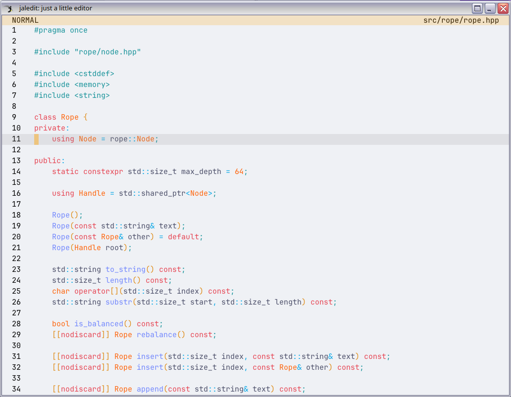

# jaledit - just a little editor

This is a source code text editor that focuses on **performance**. With the help of **different data structures and algorithms**, this editor offers **superior performance** over popular existing editors (*Vim, Nano, Visual Studio Code, Sublime Text...*), as it enables **efficient editing operations** and manages **huge files** (that would otherwise crash or stall other editors).

It is written in **C++**. There is also an incomplete port (95%) to **C** (branch [`c-rereimpl`](https://github.com/jalsol/jaledit/tree/c-rereimpl)).

## Features

It currently supports the following features:
- Fast editing operations (insertion and deletion, copy and paste, find and replace…);
- Autocompletion;
- Extensible syntax highlight;
- Vim-like navigation;
- Buffer management.

## Demonstration
- [using jaledit to solve programming problems](https://www.youtube.com/watch?v=DOiqO8f-9TY)
- [jaledit loads faster than other editors](https://www.youtube.com/watch?v=o27J9EdEBYo)

## Repository
[Here is the repository of the project on GitHub.](https://github.com/jalsol/jaledit)

## License

This project (the source code, the logo, and the released binary) is licensed under the **GNU Affero General Public License v3.0.**

## Releases

Please check out the Release section of the repository.

Since the editor invokes system calls from the Linux kernel, this editor can only be run on Linux-based OS. However, ports for other kernels are coming very soon!

## Dependencies

- A Linux-based OS (will update in the future)
- C++20 (GNU GCC 12.1.0)
- CMake 3.22 or above
- [My modified version of Raylib](https://github.com/jalsol/raylib/tree/repeated-keys)
- [Native File Dialog Extended](https://github.com/btzy/nativefiledialog-extended)

## Building

- Install the correct dependencies
- Clone this repository
- `git submodule update --init --recursive`
- `cmake -S. -Bbuild`
- `make -Cbuild [-j <number of threads>]`
- The executable `jaledit` in the directory `build/` will appear.

## Usage

jaledit is greatly inspired by Vim, one of my favorite text editors. Most features in jaledit are copied from Vim, including the keybindings and the functionalities, but with my own twists.

Please refer to the instruction [here](https://jalsol.notion.site/CS163-jaledit-just-a-little-editor-98856cfcc0b04f69b515894ce38da3f7#303faf0cb7184205bd1811804ce1c60a) for usage.

## Internal Implementation

Please refer to the [project report](https://www.notion.so/jalsol/CS163-jaledit-just-a-little-editor-98856cfcc0b04f69b515894ce38da3f7#9c3f391669e5445bb83cbb1889984c5f) for more details.
